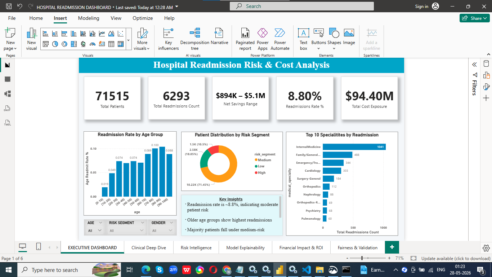
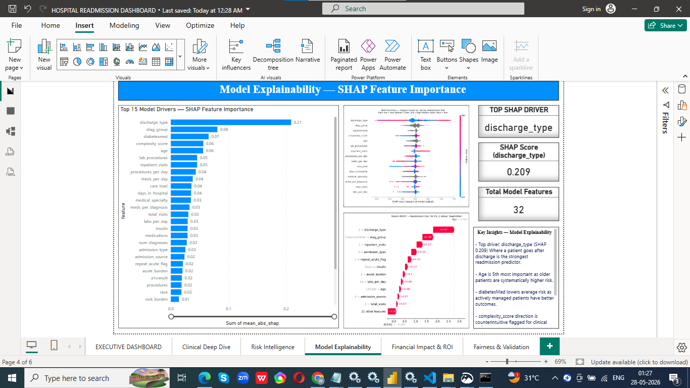
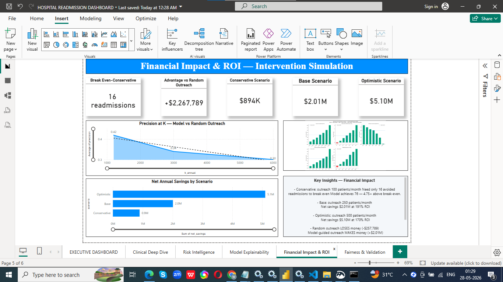

# Hospital Readmission Risk Stratification & Operational Impact Model

> A machine learning–powered decision-support prototype for 30-day readmission reduction in diabetic patient populations. Built end-to-end: PostgreSQL → CatBoost → SHAP → Power BI → Financial ROI Model.

---

## Project Summary

Hospitals lose millions annually to preventable readmissions — and face CMS penalties up to 3% of Medicare payments for excess readmission rates. This project builds a complete risk stratification system that identifies which patients are most likely to be readmitted within 30 days, explains why, quantifies the financial impact, and proves the model is fair across demographic groups.

**The core value proposition:** Model-guided outreach identifies patients at 3.86× the precision of random selection. In the Base scenario, this turns a $257,789 annual loss (random outreach) into a $2,010,000 annual gain — a swing of $2,267,789 from the same care management budget.

---

## Key Results

| Metric | Value |
|---|---|
| Dataset | UCI Diabetes 130-US Hospitals (1999–2008) |
| Unique patients | 71,515 |
| 30-day readmission rate | 8.80% |
| Model | CatBoost classifier |
| AUC-ROC | 0.6715 |
| Precision@100 | 40.0% (4.5× baseline) |
| Precision@250 | 32.4% (3.7× baseline) |
| Top-decile lift | 2.41× |
| Calibration error | 0.0096 (after isotonic regression fix) |
| High Risk readmission rate | 21.0% vs 8.8% baseline |
| Low Risk readmission rate | 2.7% vs 8.8% baseline |
| Conservative net savings | $894K/year |
| Base case net savings | $2.01M/year |
| Optimistic net savings | $5.10M/year |
| Gender fairness | PASSED (2.0pp FNR gap) |
| Race fairness | PASSED — Black vs White 1.1pp gap |
| Temporal stability | STABLE — AUC range 0.026 across time periods |

---

## Tools Used

| Tool | Purpose |
|---|---|
| PostgreSQL 18 / pgAdmin | Data storage, cleaning, SQL queries |
| Python 3.13 | ML pipeline, SHAP, calibration, fairness |
| CatBoost 1.2.10 | Readmission risk classifier |
| SHAP 0.51 | Model explainability |
| scikit-learn | Calibration, evaluation metrics |
| Power BI Desktop | 6-page interactive dashboard |
| Excel / WPS Office | Financial ROI model, executive summary |

---

## Repository Structure

```
hospital-readmission-risk-model/
│
├── README.md
├── MODEL_CARD.md
├── ASSUMPTIONS_REGISTER.md
├── FAIRNESS_REMEDIATION.md
│
├── sql/                          ← SQL scripts for data pipeline
│
├── 03_ml_rebuild_real.py         ← Main CatBoost training script
├── 04_shap_explainability.py     ← SHAP feature importance
├── 05_calibration_analysis.py    ← Calibration metrics
├── 05b_apply_calibration.py      ← Isotonic regression fix
├── 08_fairness_audit.py          ← Demographic fairness
├── 09_intervention_simulation.py ← ROI scenarios
├── 10_temporal_validation.py     ← Temporal stability
├── 13_business_case_sensitivity.py ← Sensitivity analysis
│
├── HOSPITAL READMISSION DASHBOARD.pbix
├── readmission_workbook_hospital.xlsx
│
└── [output files: PNGs and CSVs in root]
```

---

## How to Run

### Prerequisites

```bash
py -m pip install catboost shap scikit-learn pandas numpy matplotlib
```

PostgreSQL 18 must be running on port 5433 with database `readmission_db`.

### Step-by-step

```bash
# 1. Navigate to project folder
cd C:\Users\LENOVO\Desktop\readmission_ai_free

# 2. Train the model and save test data
py 03_ml_rebuild_real.py

# 3. Generate SHAP explainability outputs
py 04_shap_explainability.py

# 4. Run calibration analysis
py 05_calibration_analysis.py

# 5. Apply probability calibration fix
py 05b_apply_calibration.py

# 6. Run fairness audit
py 08_fairness_audit.py

# 7. Run intervention simulation
py 09_intervention_simulation.py

# 8. Run temporal validation
py 10_temporal_validation.py

# 9. Run business case sensitivity analysis
py 13_business_case_sensitivity.py
```

---

## Model Performance

### Discrimination metrics

| Metric | Value | Context |
|---|---|---|
| AUC-ROC | 0.6715 | LACE Index (clinical standard): 0.60–0.68 |
| Gini coefficient | 0.3431 | Moderate discriminative power |
| Average Precision | 0.1823 | vs null = 0.088 (2.1× improvement) |

### Ranking metrics (what hospitals actually use)

| K (outreached) | True positives | Precision | Lift |
|---|---|---|---|
| 50 | 23 | 46.0% | 5.23× |
| 100 | 42 | 40.0% | 4.55× |
| 250 | 85 | 34.0% | 3.86× |
| 500 | 150 | 30.0% | 3.41× |

### Calibration

| | Before fix | After fix |
|---|---|---|
| Brier Skill Score | −1.59 | +0.036 |
| Mean calibration error | 0.3552 | 0.0096 |

Isotonic regression calibration applied post-hoc. Raw probabilities were inflated due to class-weight training. Calibrated probabilities are stored in `fact_patient_risk.csv`.

---

## Risk Segments

| Segment | Patients | Threshold | Readmission rate | vs baseline |
|---|---|---|---|---|
| High | 1,502 | ≥ 14.79% calibrated | 21.0% | 2.4× |
| Medium | 10,219 | 5.03–14.79% | 8.5% | ≈ baseline |
| Low | 2,582 | < 5.03% | 2.7% | 0.31× |

---

## Financial Impact

All assumptions sourced from AHRQ and Coleman Care Transitions Program.
Cost per readmission: $15,000 (AHRQ benchmark).

| Scenario | Monthly outreach | Avoided readmissions | Net savings | ROI |
|---|---|---|---|---|
| Conservative | 100 patients | 76 | $894,000 | 372% |
| Base | 250 patients | 204 | $2,010,000 | 191% |
| Optimistic | 500 patients | 540 | $5,100,000 | 170% |

**Model vs random outreach (Base scenario, same $1.05M budget):**
- Random outreach net result: −$257,789
- Model-guided net result: +$2,010,000
- Swing from using the model: **+$2,267,789**

**Break-even thresholds (from sensitivity analysis):**
- Effectiveness must exceed 6.9% (assumed: 15–30%)
- Outreach cost must stay below $1,020/patient (assumed: $200–500)
- Precision must stay above 11.7% (actual: 30–42%)

---

## Fairness Audit

| Dimension | Group | FNR | vs overall | Status |
|---|---|---|---|---|
| Gender | Female | 84.4% | −0.9pp | PASSED |
| Gender | Male | 86.5% | +1.1pp | PASSED |
| Race | African American | 86.0% | +0.6pp | PASSED |
| Race | Caucasian | 85.0% | −0.4pp | PASSED |
| Race | Asian (n=99) | 100% | +14.6pp | Artifact — n too small |
| Age | 50–60 group | 93.1% | +7.7pp | MONITOR |

No meaningful disparity detected between African American and Caucasian patients (1.1pp gap, well within 5pp threshold). Asian group result is a statistical artifact of insufficient sample size (~5 events).

---

## Temporal Validation

| Period | Patients | AUC | Precision@10% |
|---|---|---|---|
| Early (first third) | 4,767 | 0.6612 | 21.0% |
| Middle (second third) | 4,768 | 0.6873 | 23.5% |
| Late (final third) | 4,768 | 0.6754 | 19.8% |

AUC range: 0.026 — below 3pp stability threshold. Model is temporally stable with no degradation on more recent data.

---

## Dashboard Pages

| Page | Description |
|---|---|
| 1 — Executive Dashboard | Total patients, readmission rate, cost exposure, risk donut, age chart |
| 2 — Clinical Deep Dive | Specialty table, medication burden, admission type analysis |
| 3 — Risk Intelligence | High/Medium/Low KPIs, patient detail table, risk-by-segment chart |
| 4 — Model Explainability | SHAP bar chart, beeswarm plot, individual patient explanation |
| 5 — Financial Impact & ROI | 3-scenario savings, precision@K curve, sensitivity analysis |
| 6 — Fairness & Validation | FNR by race/gender, AUC temporal stability, calibration curve |

## Dashboard Screenshots

### Executive Dashboard


### Model Explainability — SHAP


### Financial Impact & ROI


---

## Limitations

1. **Dataset age:** Data from 1999–2008. Modern diabetes medications (GLP-1 agonists, SGLT2 inhibitors) were not standard care. Clinical validation on contemporary data required before deployment.

2. **Deployment timing:** Model designed to score patients at point of discharge. `discharge_type` is the top SHAP feature (0.209) and is only available at discharge, not at admission.

3. **Population scope:** Model validated on adult diabetic patients only. Not validated for patients under 18.

4. **Calibration:** Raw model probabilities are inflated due to class-weight training. Always use `risk_score_calibrated` column, not `risk_score_raw`.

5. **Single institution validation:** This is a research prototype. Prospective validation on data from a specific institution is required before operational use.

---

## Disclaimer

This is a decision-support prototype trained on the UCI Diabetes 130-US Hospitals dataset (1999–2008). It is not a validated clinical tool and has not been evaluated on live patient data from any specific institution. All financial projections use published AHRQ benchmark assumptions. Clinical and compliance review is required before any operational deployment.

---

## Citations

- Strack B, et al. (2014). Impact of HbA1c Measurement on Hospital Readmission Rates. *BioMed Research International*.
- AHRQ Statistical Brief #248 (2019). Hospital Stays for Adults with Diabetes.
- Coleman EA, et al. (2006). The Care Transitions Intervention. *Archives of Internal Medicine*.
- CMS Hospital Readmissions Reduction Program (HRRP). cms.gov/Medicare/Quality-Initiatives.

---

## Author

Built as a healthcare analytics portfolio project demonstrating end-to-end ML pipeline design, clinical AI explainability, responsible AI practices, and financial impact modelling.

**Verified:** 2026-05-28
**Scripts:** 03_ml_rebuild_real.py → 13_business_case_sensitivity.py
"# hospital-readmission-risk-model" 
